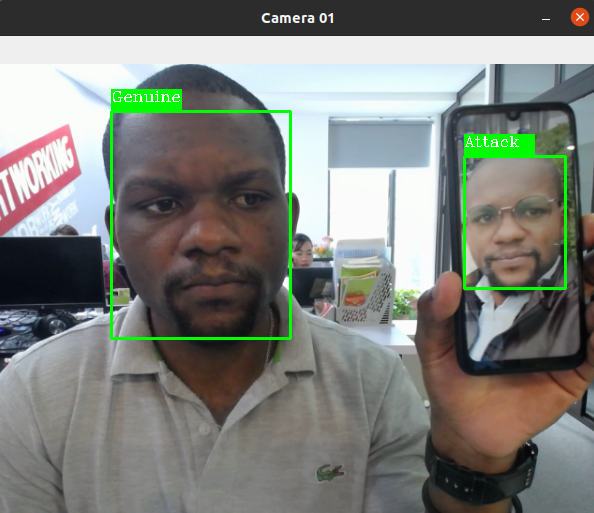
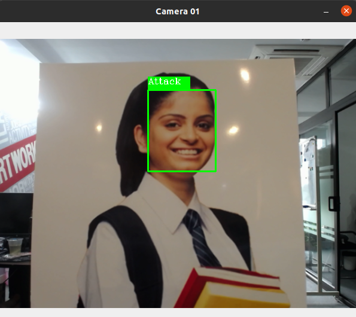
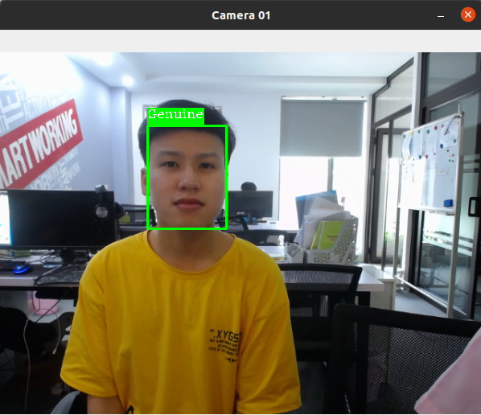

# Prototype Model For Face Anti-spoofing
Nowadays, the facial recognition system is used in several applications mainly for individual authentication. Whereas facial recognition remain vulnerable to several types
of attacks ; Face Anti-Spoofing detection is a crucial step before providing facial data to
the face recognition system.
In this work, we are committed to providing a solution to the problem of face anti-spoofing attaque through the using of the Convolutional Neural Network with the dual
pixel image sensor. The main goal is to be able to distinguish a reel/genuine face to a
fake face as much as possible. Thus being convinced of the usefulness of the information contained in the depth map of an image we opted to use it. Thus the proposed
solution to distinguish a real face from a fake one is based on the reconstruction of the
depth from a pair of images from the dual pixel camera and the classification of the
depth map. 

- This is a Single Shot Face Anti-spoofing prototype.
- Made by Pytorch and Python 3.7.x is used.

### Attack test

### Genuine test

# Installation

Please refer to the requirement.txt for all need packages to run this code efficiently
In my case after creating an anaconda environment with python 3.7.9
> conda create -n env_name python = 3.7

> conda activate env_name

> pip install -r requirement.txt

## Face landmarks
- face_alignment is used for landmarks extraction. Page [face_alignment](https://github.com/1adrianb/face-alignment). Thanks to them.
### Landmarks extraction scripts
> cd detlandmark

> python detlandmark_imgs.py dataset_dir

- You can change corresponding directory and filename in config.py
- For example train_filelists=[
      ['raw/ClientRaw','raw/client_train_raw.txt',GENUINE],
      ['raw/ImposterRaw','imposter_train_raw.txt',ATTACK]]
     test_filelists=[
      ['raw/ClientRaw','raw/client_test_raw.txt',GENUINE],
      ['raw/ImposterRaw','raw/imposter_test_raw.txt',ATTACK]
      ]

## Method
- Our method is straightforward. Small patched containing a face is cropped with corresponding landmarks. A binary classification network is used to distinguish the attack patches.

## Training
- First, edit file *config.py*, choose the target network and proper batch_size.
- Then, in terminal command: 
> make clean && make

> python3 main.py train

## Inference
- In terminal command: 
> python inference.py inference --images='detlandmark/inference_images/ * / *.jpg'
- The inference report is result/inference.txt, you can check it in commad: 
> cat result/inference.txt
## Visualize Dataset
- We have fixed the bug of choice wrong face in multiple detected faces with standard of coordinates. 
- To visualize cropped faces in dataset. Please run command:
> python3 vis_cropface.py visualize

- All faces will be shown in data/showcropface_train.jpg and data/showcropface_val.jpg

## Reference
- [1] Xiaojun Wu, Member, IEEE, Jinghui Zhou, Jun Liu, Fangyi Ni, and Haoquiang Fan; Single-Shot Face Anti-Spoofing for Dual Pixel Camera; IEEE TRANSACTIONS ON INFORMATION FORENSICS AND SECURITY, 2021
- [2] François Chollet; Xception : Deep learning with Depthwise separable Convolutions. Google, Inc., April 2017
- [3] Mikhail Nikitin et al. Face anti-spoofing with joint spoofing medium detection and eye blinking analysis, ResearchGate, june 2019
- [4] Yaojie Liu et al., Face Anti-Spoofing Using Patch and Depth-Based CNNs; ResearchGate 10, 2017
- [5] Jianzhu Guo et al., Improving Face Anti-Spoofing by 3D Virtual Synthesis, NLPR, Institute of Automation, Chinese Academy of Science, Beijing, China, 4, 2019
